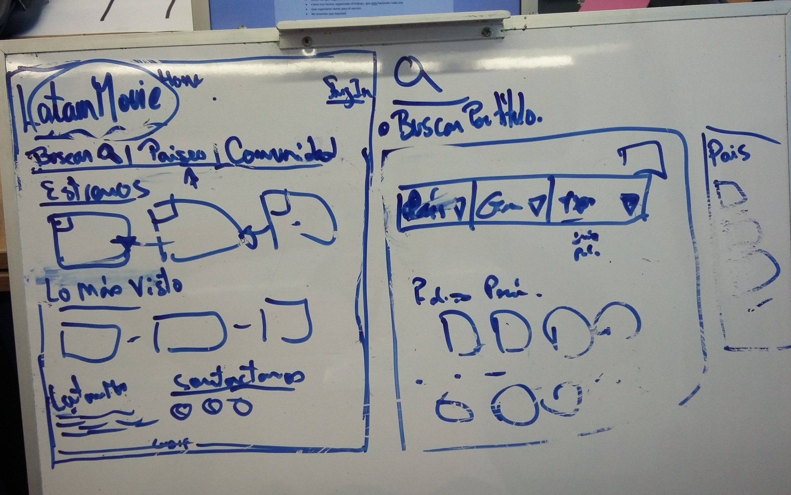
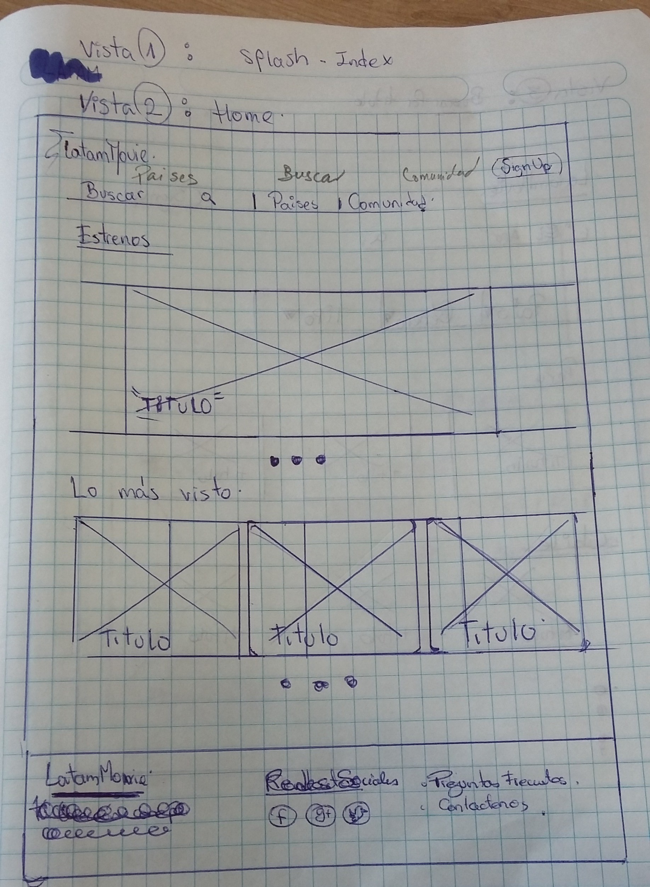
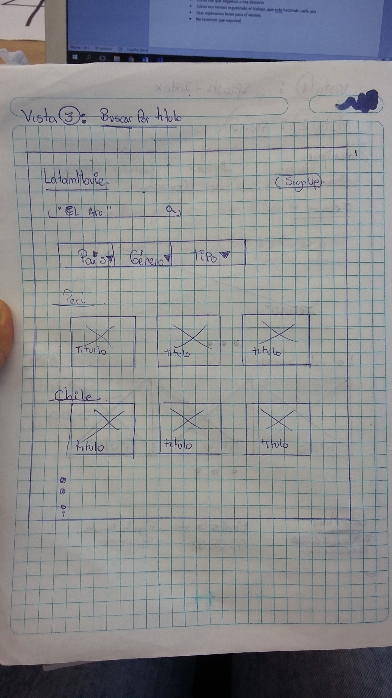
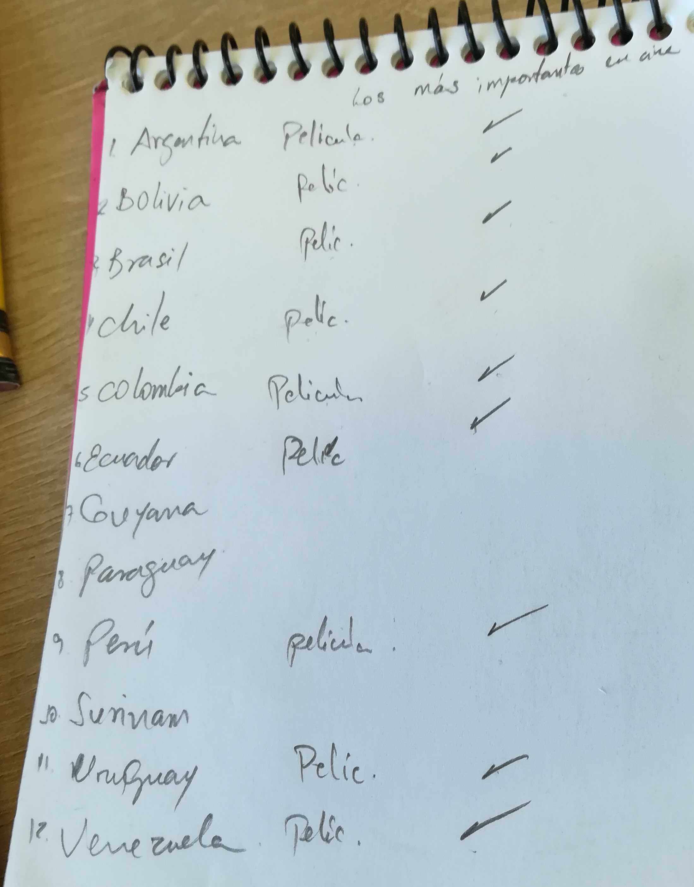

# LatamMovies

**¿DE QUÉ TRATA EL PRODUCTO?**

LatamMovies es una aplicación dónde los usuarios podrán encontrar un catálogo de series y películas producidas en países de América del Sur. Cada serie o película cuenta con información sobre su país de procedencia, sinopsis, reparto, género, duración, año, entre otros.
También podrá registrarse y acceder a un espacio para guardar las películas que ha visto y las que quiera ver más tarde.

**¿CÓMO SURGE ESTA INICIATIVA?**

La propuesta surge a partir de la necesidad de dar a conocer 
obras exitosas producidas en la región de América del Sur que no se exhiben 
en el mundo, es así como generamos la idea de crear un espacio 
donde se pueda difundir y disfrutar de la diversidad del arte cinematografico de nuestra región.

**PLANIFICACIÓN:**

* Día martes 16 de enero del 2018

| Tarea | Tiempo | Encargadas |
| :------- | :------: | -----: |
| Investigar sobre aplicaciones existentes | 09:00 a 09:30 | Todo el equipo |
| Lluvia de ideas sobre el tema | 09:30 a 10:00 | Todo el equipo |
| Elaboración 1er sketch  | 10:00 a 12:00 | Leslie N. y Zulema A. |
| Investigación sobre API OMDb | 10:00 a 12:00 | Rocci E. y Silvia F. |
| Retrospectiva | 12:00 a 13:00     | Todo el equipo |
| Maquetado | 15:00 en adelante | Leslie N. y Zulema A. |
| Investigación sobre parsehub  | 15:00 a 17:00 | Rocci E. y Silvia F. |
| Elaboración README  | 17:00 en adelante | Rocci E. y Silvia F. |

* Día miércoles 17 de enero del 2018

| Tarea | Tiempo | Encargadas |
| :------- | :------: | -----: |
| Daily | 08:00 a 08:30 | Todo el equipo |

Se está utilizando Trello para el seguimiento de las tareas planificadas. Para ver el tablero, dar click [aquí](https://trello.com/b/BQ8OvwAq/latammovies "Tablero-trello").

**Producto mínimo viable**

* Que el usuario pueda buscar series o películas por su título.
* Que al dar click en el tab “Países” se muestre una nueva vista con tres tipos de filtros: Género, País y tipo de formato (Serie o película).
* Que al dar click en cada poster de serie/película se despliegue una nueva vista con la información específica y la opción de reproducir la serie/película.
* Que el usuario pueda registrarse e iniciar sesión.
* Que el usuario pueda guardar un listado de películas que ha visto y otro listado de películas que quiera ver más tarde.

**Anexos**

Se adjuntan los sketch que se elaboraron:

