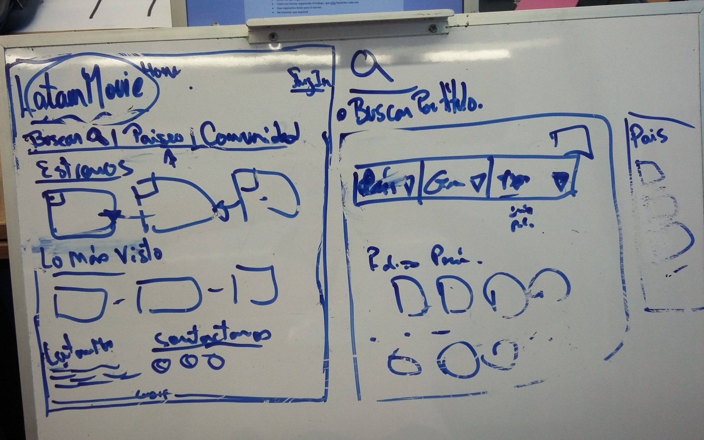
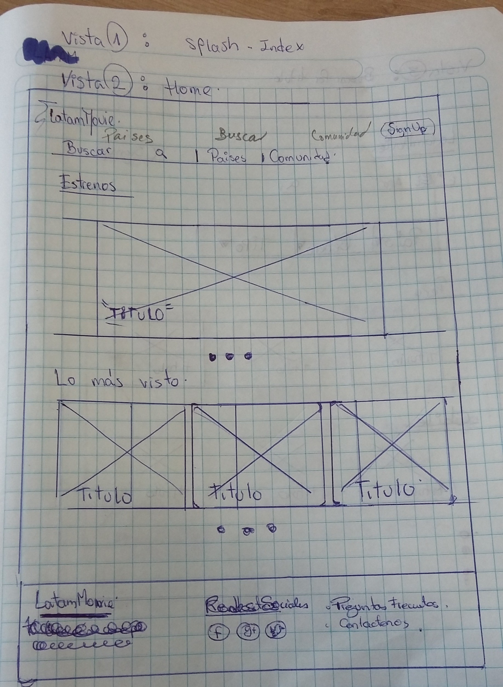
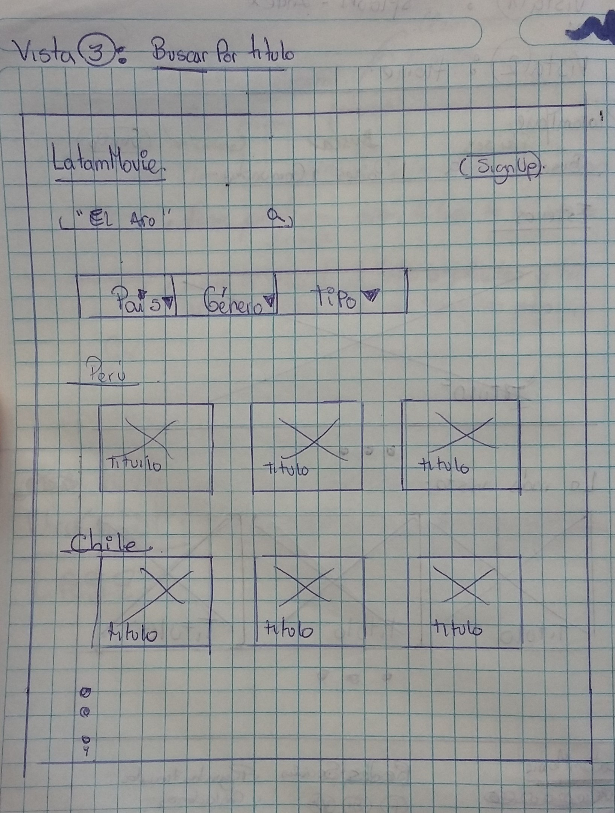
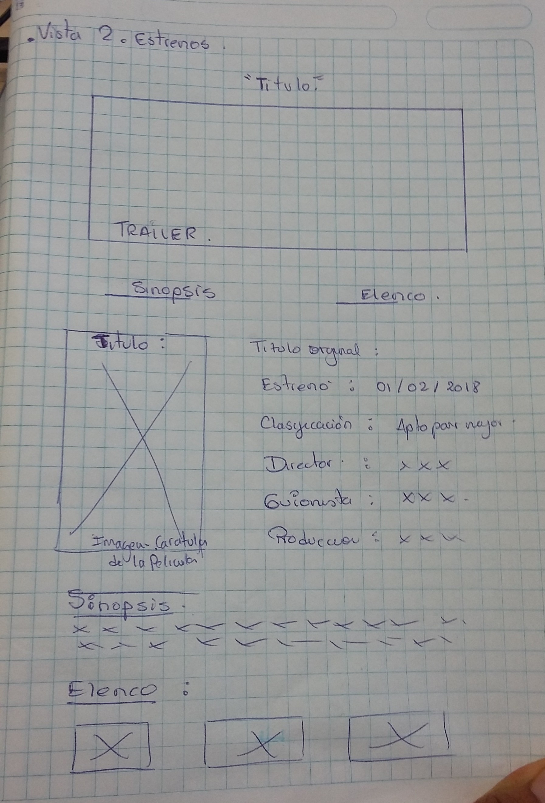
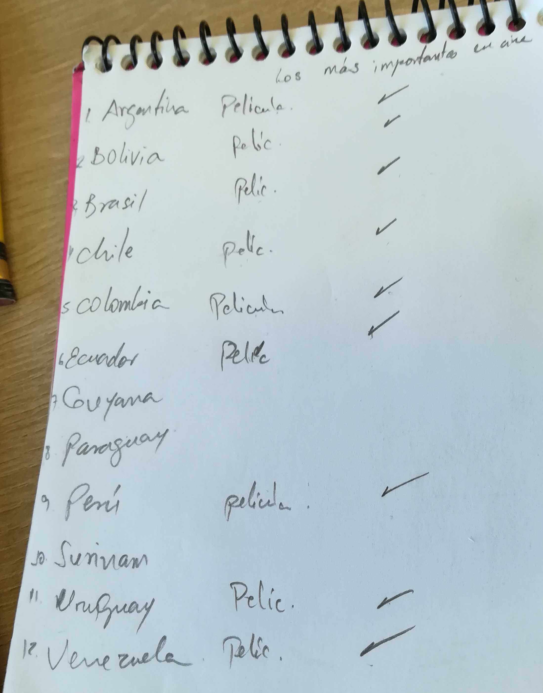

# SuraMovie

**¿DE QUÉ TRATA EL PRODUCTO?**

SuraMovie es una aplicación dónde los usuarios podrán encontrar un catálogo de series y películas producidas en países de América del Sur. Cada serie o película cuenta con información sobre su país de procedencia, sinopsis, reparto, género, duración, año, entre otros.
También podrá registrarse y acceder a un espacio para guardar las películas que ha visto y las que quiera ver más tarde.

**¿CÓMO SURGE ESTA INICIATIVA?**

La propuesta surge a partir de la necesidad de dar a conocer obras exitosas producidas en la región de América del Sur que no se exhiben en el mundo, es así como generamos la idea de crear un espacio donde se pueda difundir y disfrutar de la diversidad del arte cinematográfico de nuestra región.

En la sección "Anexos" se adjunta el resumen de la encuesta realizada a 5 usuarios.

**PLANIFICACIÓN:**

* Día martes 16 de enero del 2018

| Tarea | Tiempo | Encargadas |
| :------- | :------: | -----: |
| Investigar sobre aplicaciones existentes | 09:00 a 09:30 | Todo el equipo |
| Lluvia de ideas sobre el tema | 09:30 a 10:00 | Todo el equipo |
| Elaboración 1er sketch  | 10:00 a 12:00 | Lesly N. y Zulema A. |
| Investigación sobre API OMDb | 10:00 a 12:00 | Rocci E. y Silvia F. |
| Retrospectiva | 12:00 a 13:00     | Todo el equipo |
| Maquetado | 15:00 en adelante | Lesly N. y Zulema A. |
| Investigación sobre parsehub  | 15:00 a 17:00 | Rocci E. y Silvia F. |
| Elaboración README  | 17:00 en adelante | Rocci E. y Silvia F. |

* Día miércoles 17 de enero del 2018

| Tarea | Tiempo | Encargadas |
| :------- | :------: | -----: |
| Daily | 08:15 a 09:00 | Todo el equipo |
| Maquetado | 09:00 en 10:50 | Lesly N. y Zulema A. |
| Elaborar una base de datos con parsehub| 09:00 en 10:50 | Rocci E. y Silvia F. |
| 1era Exposición | 10:50 en 11:10 | Todo el equipo |
| Retrospectiva de la exposición | 11:10 en 12:00 | Todo el equipo |
| Maquetado | 12:00 en adelante | Lesly N. y Zulema A. |
| Investigación y uso sobre API OMDb | 12:00 en adelante | Rocci E. y Silvia F. |

* Día jueves 18 de enero del 2018

| Tarea | Tiempo | Encargadas |
| :------- | :------: | -----: |
| Daily | 08:15 a 09:00 | Todo el equipo |
| Maquetado | 09:00 en 10:00 | Lesly N. y Zulema A. |
| Funcionalidad para la búsqueda de películas | 09:00 en 18:00 | Rocci E.|
| Funcionalidad para carrusel con info de las películas | 09:00 en adelante | Silvia F.|
| Maquetado | 10:00 en adelante | Zulema A. |
| Funcionalidad para registrarse y iniciar sesión | 10:00 en adelante | Lesly N.|
| Maquetado | 18:00 en adelante | Rocci E.|

Se está utilizando Trello para el seguimiento de las tareas planificadas. Para ver el tablero, dar click [aquí](https://trello.com/b/BQ8OvwAq/suramovie "Tablero-trello").

**PRODUCTO MÍNIMO VIABLE**

* Que el usuario pueda buscar series o películas por su título.	
* Que al dar click en el tab “Países” se muestre una nueva vista con tres tipos de filtros: Género, País y tipo de formato (Serie o película).
* Que al dar click en el tab “Agenda cultural” se muestre una nueva vista con información sobre eventos, festivales de cine, convocatorias a concursos de cortometrajes, premiaciones, reproducciones al aire libre, etc.
* Que al dar click en cada poster de serie/película se despliegue una nueva vista con la información específica y la opción de reproducir la serie/película.
* Que el usuario pueda registrarse e iniciar sesión.
* Que el usuario pueda guardar un listado de películas que ha visto y otro listado de películas que quiera ver más tarde.

**ANEXOS**

**ENCUESTA:**
1.	¿Usas alguna aplicación para poder ver películas online? 

* 4 de los encuestados usan NETFLIX y piensan que el pago es excesivo. 
* Uno de los entrevistados menciona que ve películas online de páginas no seguras.

2.	¿Con qué frecuencia las usas? 

* 4 de los encuestados ven películas todos los días.
* Uno de los entrevistados sólo puede ver películas los fines de semana.

3.	¿Qué impacto tendría en ti el usar una aplicación en la que te proporcionen películas producidas en América del Sur?

* A tres de los encuestados les agradó la idea porque van a poder conocer películas producidas en la región que no son muy difundidas. 
* A dos de los encuestados no les agradó la idea porque preferirían tener acceso a películas de todas partes del mundo.

4.	¿Qué te gustaría encontrar en una aplicación sobre películas?

* Poder acceder a películas románticas, de comedia y series.
* Poder acceder a información sobre eventos culturales relacionados a festivales de películas, estrenos, etc.

**SKETCHERS**

Se adjuntan los sketch que se elaboraron:

